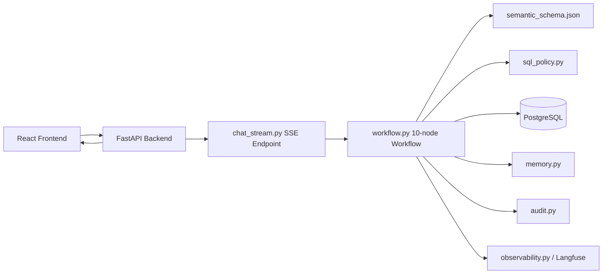
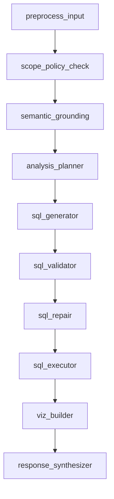

# Pharma Analytics Copilot — Agentic Text-to-SQL Assistant

Pharma Analytics Copilot is a full-stack analytics assistant for pharmaceutical sales data. A business user can ask a question in plain English, and the system turns that request into a controlled analytics workflow: it checks scope, grounds the request against a known pharma schema, generates SQL, validates it, executes it on PostgreSQL, and returns a business-friendly answer.

This project is not just a chat UI on top of an LLM. The backend implements a multi-step workflow in [backend/app/agent/workflow.py](backend/app/agent/workflow.py), uses a curated semantic schema in [backend/app/catalog/semantic_schema.json](backend/app/catalog/semantic_schema.json), applies SQL guardrails in [backend/app/security/sql_policy.py](backend/app/security/sql_policy.py), streams progress and artifacts over SSE in [backend/app/api/chat_stream.py](backend/app/api/chat_stream.py), persists chat and memory in Postgres, records audit rows, and can send traces to Langfuse when enabled.

---

## Overview

The goal of the project is to make self-service pharma analytics easier for non-technical users. Instead of asking an analyst to write SQL for every revenue, territory, trend, or product-performance question, a user can ask the question directly in the UI and get back:

- a business-friendly answer
- the SQL used
- query results
- chart-ready data / chart suggestions when available
- assumptions
- follow-up question suggestions

The system is built as a React frontend, a FastAPI backend, and a PostgreSQL database, all started through [docker-compose.yml](docker-compose.yml). The orchestration style is LangGraph-like, but implemented directly in Python rather than using the LangGraph library.

---

## Problem Statement

Business users often know what they want to ask, but they do not know:

- the schema
- the joins
- the right metric definitions
- the SQL needed to answer the question

That creates a few real problems:

1. Analysts spend time answering repeated reporting questions.
2. Generic LLM-generated SQL can hallucinate tables, joins, or columns.
3. Direct SQL generation without validation is risky.
4. Follow-up questions are hard unless the system remembers prior context.

This project addresses those issues by combining:

- semantic schema grounding from [backend/app/catalog/semantic_schema.json](backend/app/catalog/semantic_schema.json)
- a staged workflow in [backend/app/agent/workflow.py](backend/app/agent/workflow.py)
- SQL validation in [backend/app/security/sql_policy.py](backend/app/security/sql_policy.py)
- query execution in [backend/app/services/sql_executor.py](backend/app/services/sql_executor.py)
- session memory in [backend/app/services/memory.py](backend/app/services/memory.py)
- audit tracking in [backend/app/services/audit.py](backend/app/services/audit.py)
- optional Langfuse tracing in [backend/app/services/observability.py](backend/app/services/observability.py)

---

## What the System Does

- Accepts natural-language pharma analytics questions
- Understands the user’s intent and whether it is a simple or “insights” request
- Checks scope and policy before doing expensive work
- Grounds the question against the semantic schema
- Generates SQL for one or more analysis tasks
- Validates SQL before execution
- Repairs SQL when validation or execution fails with known structural errors
- Executes only allowed read-only queries on PostgreSQL
- Summarizes results in business language
- Returns SQL, table output, assumptions, and follow-up suggestions
- Streams progress and results to the frontend over SSE
- Persists chat history, metrics, memory, and audit logs
- Exposes Langfuse trace links when observability is enabled

---

## Example Questions

- What were the top products by revenue last quarter?
- Which territory had the highest sales?
- Show revenue trend by month.
- Compare product performance across regions.
- Which region had the biggest decline?
- What are the top 5 brands by units sold?
- Show quarter-over-quarter growth.
- What about the Northeast region?
- Which products are underperforming?
- Compare sales between two products.

---

## High-Level Architecture

### Frontend

The frontend is a React + TypeScript app under [frontend/src](frontend/src). It provides:

- login flow
- protected routes
- chat interface
- session sidebar
- artifact rendering for SQL, tables, chart suggestions, assumptions, follow-ups, and metrics

The main chat experience lives in [frontend/src/pages/Chat.tsx](frontend/src/pages/Chat.tsx), and it consumes streaming events from the backend.

### Backend

The backend is a FastAPI app rooted at [backend/app/main.py](backend/app/main.py). It provides:

- auth endpoints
- session/message endpoints
- a streaming chat endpoint in [backend/app/api/chat_stream.py](backend/app/api/chat_stream.py)
- the agent workflow in [backend/app/agent/workflow.py](backend/app/agent/workflow.py)
- SQL validation, execution, memory, audit, and observability services

### Database

The database is PostgreSQL and serves two roles:

1. analytics warehouse tables for the pharma demo dataset
2. application state for users, sessions, messages, audit, and memory

Current warehouse tables include:

- `fact_sales`
- `dim_product`
- `dim_territory`
- `dim_time`

Current app tables include:

- `app_user`
- `user_session`
- `chat_session`
- `chat_message`
- `audit_log`

There are also legacy `conversations` and `messages` tables in [db/00_schema.sql](db/00_schema.sql), but the active application uses `chat_session` and `chat_message` from [db/04_chat_history.sql](db/04_chat_history.sql).

### Architecture Diagram



---

## Repository Layout

| Path | Purpose |
|---|---|
| [backend/app/main.py](backend/app/main.py) | FastAPI app factory, routers, middleware, shutdown hook |
| [backend/app/api/chat_stream.py](backend/app/api/chat_stream.py) | Streaming chat endpoint over SSE |
| [backend/app/api/sessions.py](backend/app/api/sessions.py) | Session listing, message history, sync chat endpoint |
| [backend/app/agent/workflow.py](backend/app/agent/workflow.py) | 10-node agentic Text-to-SQL workflow |
| [backend/app/catalog/semantic_schema.json](backend/app/catalog/semantic_schema.json) | Semantic schema, joins, metrics, entities, data notes |
| [backend/app/security/sql_policy.py](backend/app/security/sql_policy.py) | SQL allowlist-based guardrails |
| [backend/app/services/sql_executor.py](backend/app/services/sql_executor.py) | Query execution layer |
| [backend/app/services/memory.py](backend/app/services/memory.py) | 4-layer session memory bundle |
| [backend/app/services/audit.py](backend/app/services/audit.py) | Workflow audit lifecycle |
| [backend/app/services/observability.py](backend/app/services/observability.py) | Optional Langfuse tracing wrapper |
| [frontend/src/pages/Chat.tsx](frontend/src/pages/Chat.tsx) | Main chat UI, streaming state, artifact display |
| [frontend/src/auth/AuthContext.tsx](frontend/src/auth/AuthContext.tsx) | Client-side auth state |
| [frontend/src/auth/RequireAuth.tsx](frontend/src/auth/RequireAuth.tsx) | Protected route wrapper |
| [frontend/src/api/client.ts](frontend/src/api/client.ts) | REST + SSE client |
| [db/00_schema.sql](db/00_schema.sql) | Core warehouse schema |
| [db/03_auth.sql](db/03_auth.sql) | Auth tables and demo user |
| [db/04_chat_history.sql](db/04_chat_history.sql) | Chat sessions and messages |
| [db/05_audit.sql](db/05_audit.sql) | Audit log schema |
| [db/08_memory.sql](db/08_memory.sql) | Session memory columns |

---

## Request Lifecycle

This is the shortest way to understand what happens from the moment a user asks a question to the final answer in the React UI.

1. The user signs in from the React app.
2. The chat page in [frontend/src/pages/Chat.tsx](frontend/src/pages/Chat.tsx) sends a POST request to `/api/chat/stream` using the SSE helper in [frontend/src/api/client.ts](frontend/src/api/client.ts).
3. [backend/app/api/chat_stream.py](backend/app/api/chat_stream.py):
   - resolves or creates a `chat_session`
   - stores the user message
   - loads recent message history
   - loads the session memory bundle
   - creates an audit row
   - starts `run_workflow()`
4. `run_workflow()` in [backend/app/agent/workflow.py](backend/app/agent/workflow.py) executes the 10 workflow nodes.
5. Each node emits events back to `chat_stream.py` through an async callback.
6. `chat_stream.py` streams SSE events such as:
   - `request_id`
   - `session`
   - `status`
   - `retry`
   - `artifact_sql`
   - `artifact_table`
   - `artifact_chart`
   - `answer_meta`
   - `token`
   - `metrics`
   - `audit`
   - `complete`
7. The React UI renders progress, the streaming answer, SQL artifacts, result tables, assumptions, follow-ups, and metrics.
8. When the workflow finishes, the backend persists the assistant answer, artifacts, memory updates, and audit success.

---

## Agent Workflow

The core logic is a LangGraph-style, multi-node workflow implemented directly in [backend/app/agent/workflow.py](backend/app/agent/workflow.py).

### Workflow Diagram



### Node Explanation Table

| Node | Function | What it does |
|---|---|---|
| `preprocess_input` | `_preprocess_input()` | Normalizes the message and tags it as `simple` or `insights` mode |
| `scope_policy_check` | `_scope_policy_check()` | Blocks off-topic requests, allows obvious in-scope requests, and asks for clarification when needed |
| `semantic_grounding` | `_semantic_grounding()` | Maps the question to tables, columns, filters, time range, and metrics using the semantic schema |
| `analysis_planner` | `_analysis_planner()` | Decides whether to run one task or multiple subtasks |
| `sql_generator` | `_sql_generator()` | Generates SQL for each task with schema and policy context |
| `sql_validator` | `_sql_validator()` | Runs allowlist-based SQL validation |
| `sql_repair` | `_sql_repair()` | Repairs invalid SQL when validation fails |
| `sql_executor` | `_sql_executor_node()` | Executes validated SQL and emits SQL/table artifacts |
| `viz_builder` | `_viz_builder()` | Suggests a chart spec from the first usable result set |
| `response_synthesizer` | `_response_synthesizer()` | Produces the final plain-text answer, assumptions, and follow-ups |

### Notes on Current Behavior

- “Insights” mode is implemented, but it is still LLM-driven planning rather than a dedicated analytical engine.
- Charting is advisory. The `viz_builder` node returns a chart suggestion or chart-ready fields, but this is not a full BI charting system.
- The workflow is traced with the Langfuse `@observe` decorator when enabled.

---

## Text-to-SQL: From Plain English to Safe SQL

The Text-to-SQL path is intentionally staged.

### 1. Intent understanding
The system first decides whether the user is asking a simple metric question or a broader “insights” question in `preprocess_input`.

### 2. Scope and policy filtering
Before any SQL work begins, `scope_policy_check` blocks clearly unrelated questions such as jokes, recipes, or prompt-injection style instructions.

### 3. Semantic grounding
The question is grounded against [backend/app/catalog/semantic_schema.json](backend/app/catalog/semantic_schema.json), which describes:

- tables
- columns
- joins
- metrics
- known products, companies, therapeutic areas, regions, and states
- seeded data notes

### 4. SQL generation
The workflow then asks the model to generate PostgreSQL SQL with explicit aliasing and join rules.

### 5. SQL validation and repair
Generated SQL is validated. If it fails policy or structure checks, the workflow enters a repair loop.

### 6. SQL execution and answer generation
Only validated SQL is executed. The result is then turned into a plain-text business answer with assumptions and suggested follow-ups.

---

## Semantic Schema Grounding

The semantic grounding layer is one of the main reasons this project is more reliable than a generic chat-to-SQL demo.

### Where it lives
- [backend/app/catalog/semantic_schema.json](backend/app/catalog/semantic_schema.json)
- [backend/app/agent/workflow.py](backend/app/agent/workflow.py)

### What it contains
- schema descriptions for `dim_product`, `dim_territory`, `dim_time`, and `fact_sales`
- explicit joins
- named business metrics like `net_sales_usd`, `trx`, `nrx`, and `nrx_share`
- known business entities like brand names and regions
- seeded data notes such as the Cardivex Q3 decline and Oncoshield growth pattern

### Why it matters
Without grounding, a generic LLM can hallucinate tables or columns. Here, the workflow uses a curated schema summary to reduce that risk and keep SQL generation tied to the real warehouse model.

---

## SQL Safety and Guardrails

SQL safety is handled primarily in [backend/app/security/sql_policy.py](backend/app/security/sql_policy.py).

### Current guardrails
- only `SELECT` or `WITH ... SELECT` statements are allowed
- multiple statements are blocked
- DDL and DML keywords are blocked
- only allowlisted analytics tables are allowed
- execution is bounded by row limits in the runtime flow

### Current allowlisted tables
- `fact_sales`
- `dim_product`
- `dim_territory`
- `dim_time`

### Important note
This is a strong prototype guardrail layer, but it is still allowlist/regex-based rather than AST-based SQL validation. That is good enough for a controlled demo and interview discussion, but it is not the final form of production SQL policy enforcement.

---

## Memory

Memory is implemented in [backend/app/services/memory.py](backend/app/services/memory.py) and stored on `chat_session` via [db/08_memory.sql](db/08_memory.sql).

### Current memory layers
1. `recent_messages` — last few turns from `chat_message`
2. `summary` — rolling plain-text session summary
3. `context_json` — structured context like metric, dimensions, filters, time window
4. `last_sql_intent` — last SQL-oriented analysis intent

### What this enables
- follow-up questions such as “What about the Northeast region?”
- reuse of prior analysis context
- more stable prompting in the grounding and planning stages

### Current limitation
This is session memory, not a full retrieval system. The project does not currently implement semantic retrieval over a broader business glossary, prior SQL library, or external documents.

---

## Auditability and Observability

### Audit Tracking

Audit logging is implemented in [backend/app/services/audit.py](backend/app/services/audit.py) and stored in the `audit_log` table created by [db/05_audit.sql](db/05_audit.sql).

Each workflow run can record:

- request ID
- user ID and session ID
- mode (`stream` or `sync`)
- task count
- retries used
- tables used
- timings
- rows returned
- success/failure state
- error message

### Langfuse Observability

Optional Langfuse tracing is wrapped in [backend/app/services/observability.py](backend/app/services/observability.py).

Current behavior:

- no-op fallback when Langfuse is disabled
- trace/span/generation logging when enabled
- redaction/truncation of sensitive or oversized metadata
- trace URLs surfaced to the frontend via `metrics_json`
- shutdown flush hook wired in [backend/app/main.py](backend/app/main.py)

### Important note
Langfuse is optional. The project can run without it. When enabled and configured correctly, the UI shows a “View Trace” link in the assistant metrics footer.

---

## Frontend Notes

The frontend is intentionally simple and focused on the interview story.

### Current frontend behavior
- auth state managed in [frontend/src/auth/AuthContext.tsx](frontend/src/auth/AuthContext.tsx)
- route protection in [frontend/src/auth/RequireAuth.tsx](frontend/src/auth/RequireAuth.tsx)
- session list and logout in [frontend/src/components/Sidebar.tsx](frontend/src/components/Sidebar.tsx)
- streaming chat UI in [frontend/src/pages/Chat.tsx](frontend/src/pages/Chat.tsx)
- SQL, table, chart, assumptions, follow-up, and metrics panels rendered per assistant message

The frontend uses fetch-based SSE parsing from [frontend/src/api/client.ts](frontend/src/api/client.ts) because the chat endpoint is a POST stream rather than a simple `EventSource` GET stream.

---

## Database Notes

### Analytics schema
Defined in [db/00_schema.sql](db/00_schema.sql) and seeded in [db/01_seed.sql](db/01_seed.sql).

### Auth and sessions
Defined in [db/03_auth.sql](db/03_auth.sql):

- `app_user`
- `user_session`

### Chat history
Defined in [db/04_chat_history.sql](db/04_chat_history.sql):

- `chat_session`
- `chat_message`

### Audit
Defined in [db/05_audit.sql](db/05_audit.sql):

- `audit_log`

### Memory
Added in [db/08_memory.sql](db/08_memory.sql):

- `summary`
- `context_json`
- `last_sql_intent`

---

## Local Run Instructions

### Prerequisites

- Docker
- Docker Compose v2

### 1. Clone the repo

```bash
git clone https://github.com/AbhishekDuddupudi/Pharma_DataAnalyst_Bot.git
cd Pharma_DataAnalyst_Bot
```

### 2. Create your environment file

```bash
cp .env.example .env
```

Edit `.env` and set at least:

- `OPENAI_API_KEY`

Optional:

- `LANGFUSE_ENABLED=true`
- `LANGFUSE_PUBLIC_KEY=...`
- `LANGFUSE_SECRET_KEY=...`
- `LANGFUSE_HOST=https://cloud.langfuse.com` or your region host

See [.env.example](.env.example) for the full template.

### 3. Start the stack

```bash
docker compose up --build
```

This starts:

- PostgreSQL on `localhost:5432`
- FastAPI backend on `http://localhost:8000`
- React frontend on `http://localhost:5173`

### 4. Sign in with the demo user

The demo user is seeded in [db/03_auth.sql](db/03_auth.sql):

- Email: `demo@example.com`
- Password: `demo123`

### 5. Open the app

Go to:

```text
http://localhost:5173
```

### Notes

- The Docker compose setup is currently development-friendly. The backend runs `uvicorn ... --reload`, which is convenient for local work but not a production deployment setup.
- If you want a clean rebuild and reseed:

```bash
docker compose down -v
docker compose up --build
```

---

## Current State: What Is Implemented vs What Is Not

### Implemented now
- React frontend with auth, session sidebar, and streaming chat UI
- FastAPI backend with auth, session endpoints, and SSE streaming
- 10-node agentic Text-to-SQL workflow
- semantic schema grounding
- SQL allowlist validation and repair loop
- PostgreSQL execution layer
- session memory
- audit logging
- optional Langfuse tracing

### Partially implemented / important caveats
- “Insights” mode is implemented, but it is still prompt-driven decomposition rather than a deeper analytical engine
- charting is advisory through `viz_builder`; it suggests chart specs but is not a full charting engine
- Langfuse tracing is optional and depends on valid runtime credentials

### Not implemented yet
- RBAC / role-based access control
- multi-tenant data isolation
- AST-level SQL validation
- retrieval-backed memory beyond session context
- async durable job queue
- caching layer such as Redis
- eval framework for regression testing model quality

---

## Version 2 Roadmap

The items below are future improvements. They are not all implemented in the current codebase.

### Conservative, repo-based improvements

1. **Stronger SQL guardrails**
   - move from allowlist/regex validation toward AST-based SQL parsing
   - add query timeouts and stronger cost controls

2. **Deeper evaluation**
   - build a regression suite for Text-to-SQL correctness, safety, follow-up quality, and latency

3. **Better memory**
   - expand from session memory to retrieval-backed memory over prior successful analyses and business definitions

4. **Richer chart handling**
   - turn chart suggestions into more structured chart-ready payloads and richer frontend rendering

5. **Deployment hardening**
   - remove dev-only runtime defaults, tighten secrets handling, and add production deployment profiles

### Broader production upgrades

1. **MCP layer / typed tools**
   - expose schema lookup, SQL execution, glossary lookup, and retrieval as governed tools instead of keeping everything tightly coupled inside the workflow

2. **RBAC and tenancy**
   - add roles, organizations, tenant isolation, and possibly row-level security

3. **Caching**
   - add Redis for session caching, rate limiting, idempotency, and repeated semantic lookups

4. **Async jobs**
   - move long-running workflow execution into a durable async job system while keeping the frontend streaming experience

5. **Evaluation framework**
   - add benchmark datasets, safety probes, release gating, and prompt/model version comparisons

6. **Richer business glossary**
   - add reusable metric definitions, dimension descriptions, and domain-specific definitions beyond the current semantic schema JSON

7. **Monitoring and alerting**
   - keep Langfuse for traces, but add metrics dashboards and alerts for latency, failures, retries, and spend

8. **CI/CD and security hardening**
   - add automated tests, build pipelines, container scanning, migration discipline, and managed secret storage

---

## How I Would Explain This Project in an Interview

Here is a natural way to describe it:

> I built a pharma analytics copilot that lets a business user ask sales questions in plain English instead of writing SQL. The frontend is React, the backend is FastAPI, and the data lives in PostgreSQL. The core logic is a 10-step workflow in `backend/app/agent/workflow.py` that checks scope, grounds the request against `semantic_schema.json`, generates SQL, validates it through `sql_policy.py`, repairs it if needed, executes it, and then streams the final answer back to the UI through `chat_stream.py` using SSE. I also added session memory in `memory.py`, audit logging in `audit.py`, and optional Langfuse tracing in `observability.py`, so it’s not just a chatbot — it’s a controlled analytics system with safety, traceability, and a clear request lifecycle.

### Short interview framing

- **Problem solved:** self-service analytics for pharma sales users who don’t know SQL
- **Why it matters:** reduces analyst bottlenecks and makes analytics conversational
- **Why it is more than a chatbot:** schema grounding, SQL guardrails, repair loop, audit, memory, and tracing
- **Honest limitations:** synthetic data, fixed schema, charting is advisory, insights mode is still LLM-driven, not yet fully production-ready

---

## Final Notes

This repo is best understood as a strong prototype with production-style patterns. It already shows:

- controlled Text-to-SQL orchestration
- schema grounding
- SQL safety
- streaming UX
- session memory
- auditability
- optional tracing

It is also honest about what still needs to be done before enterprise production use.
